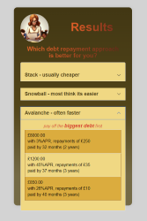

# Debt Comparison

```bash
docker pull annwyl21/debt_comparison
```

## To compare debts in order to identify the fastest repayment method

This calculator was developed solely by me, as part of a larger group project to create a financial advice website.

Debt repayment approaches can seem complicated and confusing, this app uses simple maths to help calculate those approaches and make an **informed choice** about debt repayment. The calculator is designed to compare 3 methods of debt repayment called the snowball, stack and avalanche approaches.

- A **snowball** approach is to pay off the smallest debt first, this is popular because it is often the easiest approach giving a high level of achievement because the smallest debts are cleared first and seemlingly faster.
- A **stack** approach is to pay off the debt with the highest level of interest first. This is a popular approach because it can be the cheaper option.
- An **avalanche** approach is to pay off the largest debt first, this can be a faster approach but is harder to commit to.
In all 3 approaches the __key to success__ is to commit a set amount of money to a baseline repayment and when one debt is repaid in full, instead of taking back that extra cash to keep the same amount of money going towards the debt and increase the repayments on the next debt.

Limitations:
- This app uses basic GCSE maths, it does not calculate compound interest or give the user an option to __top-up__ repayments, and 3 debts must be entered for the calculation to run.
- This app does not handle negative interest rates.

This is the full results page generated:



The page is now mobile screen sized so the results can no longer be viewed all on a single page, however earlier in the design phase they could be and here is what they looked like.


===
## How to Run this Project with Docker

To run this project, you will need to have Docker installed on your system. If you don't have Docker installed, you can download and install it from the [Docker website](https://www.docker.com/get-started).

Here are the steps to get this project up and running:

1. **Clone the repository**

   First, you need to get a copy of this project on your computer. You can do this by cloning the repository. Open a terminal and run:

   ```bash
   git clone https://github.com/annwyl21/debt_comparison.git
   ```

2. **Navigate to the project directory**

   Change your current directory to the project's directory with the following command:

   ```bash
   cd debt_comparion
   ```

3. **Build the Docker Image**

   Next, you'll use Docker to build the image from the Dockerfile. This might take a few minutes. Run:

   ```bash
   docker build -t annwyl21_debt_comparison .
   ```

4. **Run the Docker Container**

   Now you can run your project in a Docker container:

   ```bash
   docker run -p 5000:5000 annwyl21_debt_comparison
   ```
The application should now be running on [localhost:5000](http://localhost:5000)
